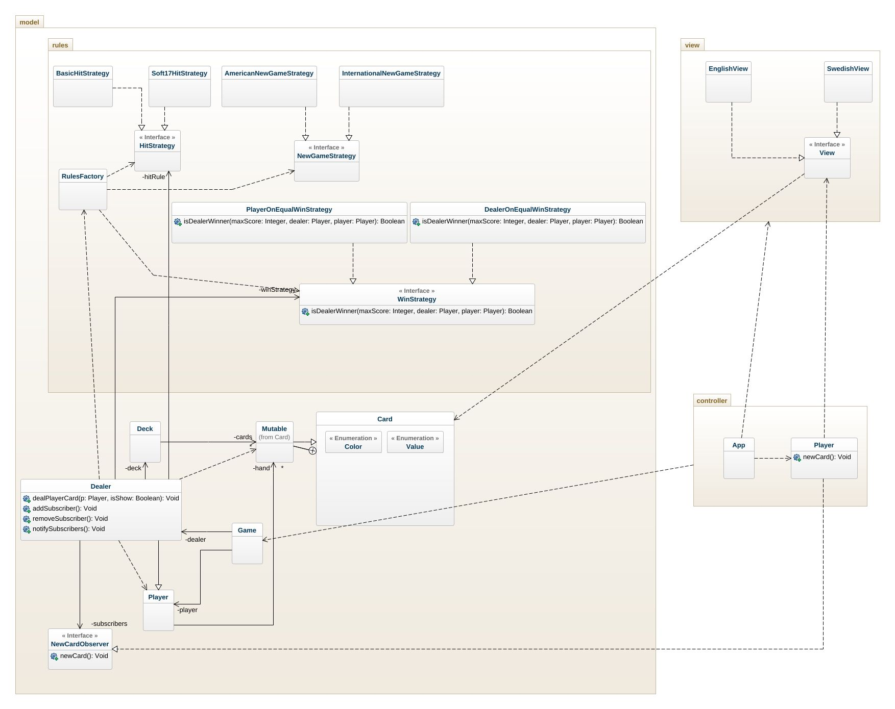

# BlackJack OO-Design
This document describes the current design. Note that some dependencies have been left out for readability reasons. For example there are a lot of dependencies to the Card class.

## Class Diagram (updated)
The application uses the model-view-controller (MVC) architectural pattern. The view is passive and gets called from the controller. 

The Soft17HitStrategy is implemented as a HitStrategy. The WinStrategy is used to decide who wins. PlayerOnEqualWinStrategy and DealerOnEqualWinStrategy are two different win strategies. The observer pattern is used to send an event from the model to the controller when a Player or Dealer get a new card. The Dealer class is the publisher, NewCardObserver is the observer interface and the Player controller is the subscriber.

## Stand - Sequence Diagram
This is the detailed sequence diagram for the `Game.stand` method. This is what should be implemented.

